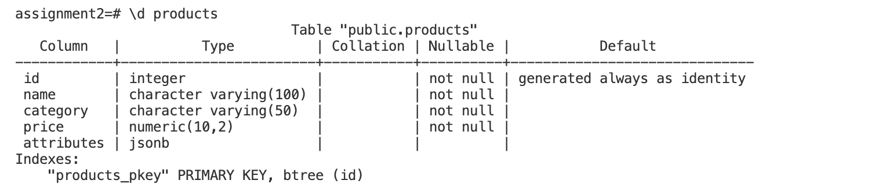
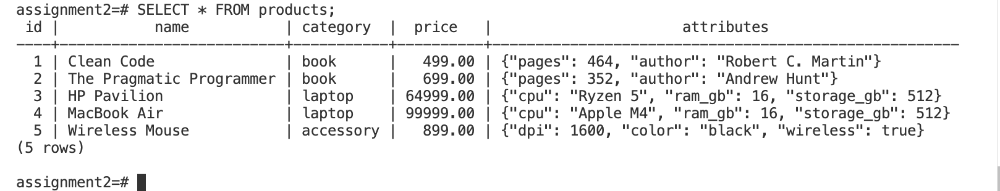
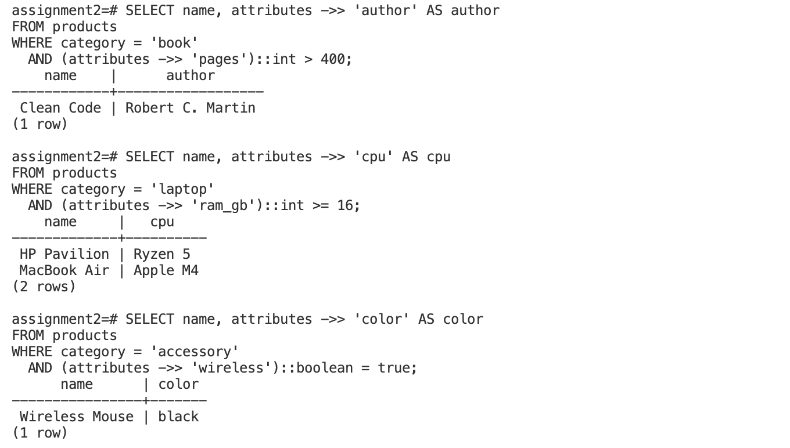
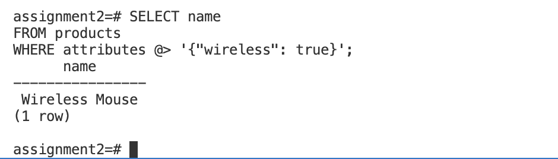
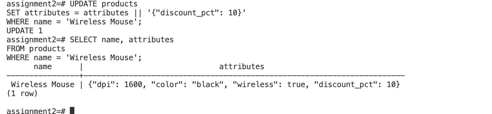
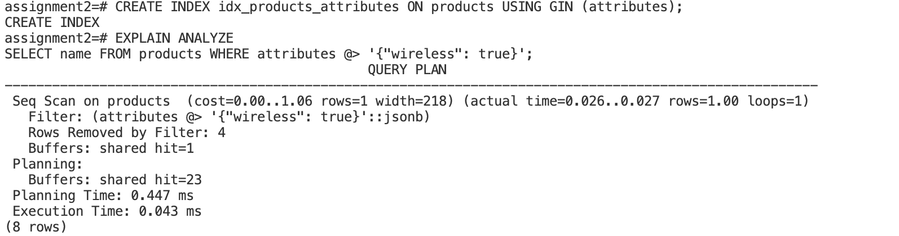
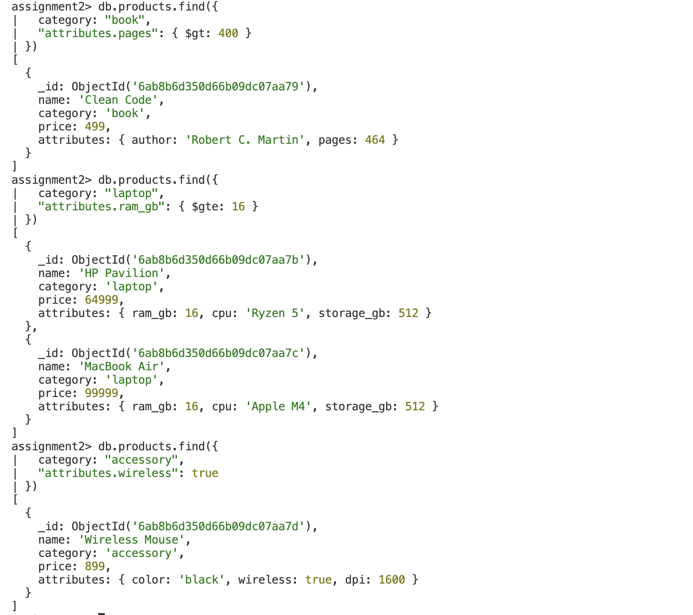

# Assignment 2

## Part A — Conceptual Questions

### 1. What is JSONB in PostgreSQL? How is it different from JSON?

`JSONB` is a data type in PostgreSQL used to store JSON data in a binary format. Unlike the normal `JSON` type, which stores the original JSON text, `JSONB` stores the data in a decomposed binary representation. Because of this, PostgreSQL can process and query JSONB data more efficiently.

The `JSON` type preserves the original formatting, whitespace, and key order of the JSON document. JSONB does not preserve these details because it stores the data in a processed form. JSONB can take slightly more time during insertion because PostgreSQL has to parse and convert the JSON data into its binary representation. However, JSONB generally provides faster querying and supports indexing, which makes it useful when JSON data needs to be searched frequently.

For example, a JSONB column can be queried using:

```sql
SELECT name, attributes ->> 'author' AS author
FROM products
WHERE category = 'book';
```

Here, the `attributes` column contains JSONB data. JSONB is useful when applications need flexible attributes while still using PostgreSQL's relational database features.

---

### 2. How can PostgreSQL work as both SQL and NoSQL in the same table?

PostgreSQL can support both SQL and NoSQL-style data in the same table by combining normal relational columns with a `JSONB` column. The normal columns follow a strict structure and data types, while the JSONB column can store flexible and changing attributes.

For example, the products table has fixed columns such as `id`, `name`, `category`, and `price`. These columns follow PostgreSQL's relational structure. The `attributes` column is JSONB, so different categories can store different types of information. A book can have an author and number of pages, while a laptop can have RAM, CPU, and storage information.

Example:

```sql
CREATE TABLE products (
    id INTEGER GENERATED ALWAYS AS IDENTITY PRIMARY KEY,
    name VARCHAR(100) NOT NULL,
    category VARCHAR(50) NOT NULL,
    price NUMERIC(10,2) NOT NULL,
    attributes JSONB
);
```

For example, a book can store:

```json
{"author": "Robert C. Martin", "pages": 464}
```

while a laptop can store:

```json
{"ram_gb": 16, "cpu": "Ryzen 5", "storage_gb": 512}
```

Thus, PostgreSQL provides structured SQL columns together with flexible JSONB data in the same table.

---

### 3. Explain the JSONB operators ->, ->>, @>, and ?. What values do they return?

PostgreSQL provides several operators for working with JSONB data. The `->` operator extracts a JSON or JSONB value, while the `->>` operator extracts the value as text. The main difference is the returned data type. For example:

```sql
SELECT attributes -> 'author'
FROM products
WHERE name = 'Clean Code';
```

This returns the author as a JSONB value. On the other hand:

```sql
SELECT attributes ->> 'author'
FROM products
WHERE name = 'Clean Code';
```

returns the author as text.

The `@>` operator checks whether one JSONB value contains another JSONB value. For example:

```sql
SELECT name
FROM products
WHERE attributes @> '{"wireless": true}';
```

This finds products whose attributes contain `wireless: true`.

The `?` operator checks whether a specified key exists in a JSONB object.

```sql
SELECT name
FROM products
WHERE attributes ? 'wireless';
```

This returns products that contain the `wireless` key. These operators make it possible to search and extract information from JSONB data directly using SQL.

---

### 4. What is a GIN index on JSONB? What queries does it speed up and what query does it not help?

A GIN (Generalized Inverted Index) index is an index type in PostgreSQL that can be used with JSONB data. It stores information about the keys and values inside JSONB documents so that PostgreSQL can find matching records more efficiently, especially when the table contains a large amount of JSONB data.

A GIN index can be created on the `attributes` column using:

```sql
CREATE INDEX idx_products_attributes
ON products USING GIN (attributes);
```

It is useful for JSONB queries involving operators such as `@>` for containment and `?` for checking whether a key exists. For example:

```sql
SELECT name
FROM products
WHERE attributes @> '{"wireless": true}';
```

A GIN index on the whole JSONB column does not directly help with every type of query. For example, the following query extracts `ram_gb`, converts it to an integer, and performs a range comparison:

```sql
SELECT name
FROM products
WHERE category = 'laptop'
  AND (attributes ->> 'ram_gb')::int >= 16;
```

A normal GIN index on the complete JSONB column is not designed specifically for this expression and range comparison. A separate suitable expression or other index would be needed for such a query.

---

### 5. PostgreSQL + JSONB vs MongoDB

PostgreSQL with JSONB and MongoDB can both store flexible data, but they use different database models. PostgreSQL is a relational database, so it provides tables, typed columns, SQL queries, joins, and strong schema enforcement for normal columns. JSONB adds flexibility by allowing additional attributes to be stored inside a column.

MongoDB is a document-oriented database. It stores information as BSON documents, which are similar to JSON documents. Its flexible document structure allows different documents in a collection to contain different fields.

Both PostgreSQL and MongoDB support transactions. PostgreSQL is especially useful when applications require relational transactions and joins between structured tables. PostgreSQL also allows core fields to have fixed data types while JSONB stores flexible attributes.

MongoDB is designed around documents and provides features such as horizontal scaling through sharding. PostgreSQL can also be used for systems that need to scale, but its main model is relational rather than document-oriented.

Therefore, PostgreSQL with JSONB is useful when an application needs both relational features and flexible JSON data, while MongoDB is designed primarily around flexible document storage.

---

# Part B — Practical Tasks

## Task 1 — Create Products Table

```sql
CREATE TABLE products (
    id INTEGER GENERATED ALWAYS AS IDENTITY PRIMARY KEY,
    name VARCHAR(100) NOT NULL,
    category VARCHAR(50) NOT NULL,
    price NUMERIC(10,2) NOT NULL,
    attributes JSONB
);
```



---

## Task 2 — Insert 5 Products

```sql
INSERT INTO products (name, category, price, attributes) VALUES
('Clean Code', 'book', 499.00,
    '{"author": "Robert C. Martin", "pages": 464}'),
('The Pragmatic Programmer', 'book', 699.00,
    '{"author": "Andrew Hunt", "pages": 352}'),
('HP Pavilion', 'laptop', 64999.00,
    '{"ram_gb": 16, "cpu": "Ryzen 5", "storage_gb": 512}'),
('MacBook Air', 'laptop', 99999.00,
    '{"ram_gb": 16, "cpu": "Apple M4", "storage_gb": 512}'),
('Wireless Mouse', 'accessory', 899.00,
    '{"color": "black", "wireless": true, "dpi": 1600}');
```



---

## Task 3 — Category-Specific JSONB Queries

### Books

```sql
SELECT name, attributes ->> 'author' AS author
FROM products
WHERE category = 'book'
  AND (attributes ->> 'pages')::int > 400;
```

**Result:** Clean Code — Robert C. Martin

### Laptops

```sql
SELECT name, attributes ->> 'cpu' AS cpu
FROM products
WHERE category = 'laptop'
  AND (attributes ->> 'ram_gb')::int >= 16;
```

**Result:** HP Pavilion — Ryzen 5  
**Result:** MacBook Air — Apple M4

### Accessories

```sql
SELECT name, attributes ->> 'color' AS color
FROM products
WHERE category = 'accessory'
  AND (attributes ->> 'wireless')::boolean = true;
```

**Result:** Wireless Mouse — black



---

## Task 4 — JSONB Containment

```sql
SELECT name
FROM products
WHERE attributes @> '{"wireless": true}';
```

**Result:** Wireless Mouse



---

## Task 5 — Update JSONB

```sql
UPDATE products
SET attributes = attributes || '{"discount_pct": 10}'
WHERE name = 'Wireless Mouse';
```

**Result:** The `discount_pct` attribute was added to Wireless Mouse.



---

## Task 6 — Create GIN Index and EXPLAIN ANALYZE

```sql
CREATE INDEX idx_products_attributes
ON products USING GIN (attributes);
```

```sql
EXPLAIN ANALYZE
SELECT name
FROM products
WHERE attributes @> '{"wireless": true}';
```

The query returned Wireless Mouse. PostgreSQL used a sequential scan because the table contains only five rows.



---

## Task 7 — MongoDB

### Recreate the Products Collection

```javascript
db.products.insertMany([
  {
    name: "Clean Code",
    category: "book",
    price: 499.00,
    attributes: {
      author: "Robert C. Martin",
      pages: 464
    }
  },
  {
    name: "The Pragmatic Programmer",
    category: "book",
    price: 699.00,
    attributes: {
      author: "Andrew Hunt",
      pages: 352
    }
  },
  {
    name: "HP Pavilion",
    category: "laptop",
    price: 64999.00,
    attributes: {
      ram_gb: 16,
      cpu: "Ryzen 5",
      storage_gb: 512
    }
  },
  {
    name: "MacBook Air",
    category: "laptop",
    price: 99999.00,
    attributes: {
      ram_gb: 16,
      cpu: "Apple M4",
      storage_gb: 512
    }
  },
  {
    name: "Wireless Mouse",
    category: "accessory",
    price: 899.00,
    attributes: {
      color: "black",
      wireless: true,
      dpi: 1600
    }
  }
])
```

### Book Query

```javascript
db.products.find({
  category: "book",
  "attributes.pages": { $gt: 400 }
})
```

**Result:** Clean Code

### Laptop Query

```javascript
db.products.find({
  category: "laptop",
  "attributes.ram_gb": { $gte: 16 }
})
```

**Result:** HP Pavilion and MacBook Air

### Accessory Query

```javascript
db.products.find({
  category: "accessory",
  "attributes.wireless": true
})
```

**Result:** Wireless Mouse



### PostgreSQL vs MongoDB

| Point | PostgreSQL + JSONB | MongoDB |
|---|---|---|
| **Syntax** | Uses SQL with JSONB operators such as `->>`, `@>`, and `?`. Example: `WHERE attributes @> '{"wireless": true}'` | Uses MongoDB query syntax with dot notation and operators such as `$gt` and `$gte`. Example: `"attributes.wireless": true` |
| **Indexing** | JSONB can be indexed using a **GIN index**, such as `CREATE INDEX ... USING GIN (attributes);` | MongoDB supports indexes on document fields, including nested fields such as `attributes.wireless`. |
| **Ease of querying** | Convenient when working with both structured relational columns and JSONB data. | Convenient for document-style data because nested attributes can be queried directly using dot notation. |